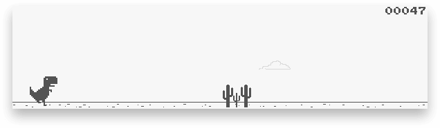

<h1 align="center">
  
</h1>

Chris Deacy made a nice clone of the chrome dino game.

I took his source and extended it into a fun little party game.

You have one big shared screen, and all players use their phones to connect and allow accelerometer access.

Then all people need to jump to start the game (you can fake it with shaking your phone of course, this is an evening hack project not nasa stuff).
When the dino is facing cacti all people need to jump again. Only if more than 70% of the players jump roughly at the same time, the dino will jump too.
Phones make a sound to have it easier to identify people who are out of sync, and it should result in a funny concert :D

## How to run

In order to run the app you need node 12+ and enable SSL (I personally used caddy reverse proxy for running it on a digital ocean machine, cause it handled the SSL for me).

Then you open /game.html on your domain on a computer attached to a projector or big tv.

Your co-players all visit the root url / of your domain.

The last visitor of game.html becomes the host automatically. No authentication my friends, like Chuck Norris would too.

